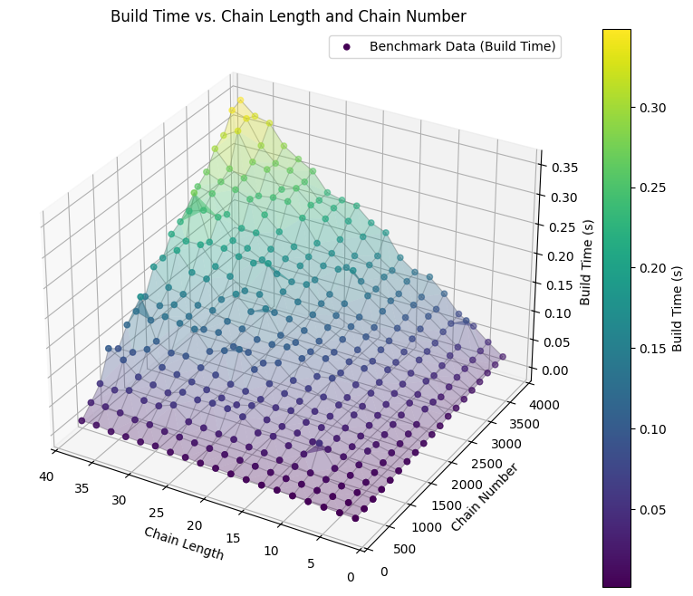
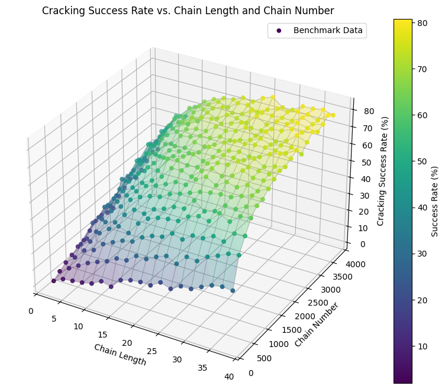
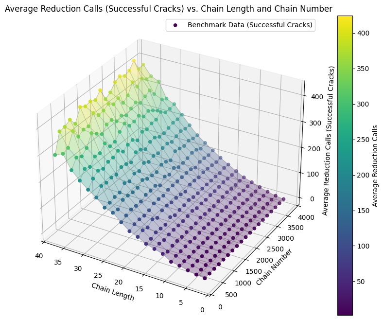

# Password Cracking project

Group: [Group 4 / Bailin Lei | Yousra Al Mowahed | Yuchen Wang]


## Problem statement

Weak and improperly stored passwords remain a primary attack vector for account compromise. This project demonstrates common password-cracking techniques and simple protection mechanisms so students can:

• see how attackers recover weak passwords (brute-force, dictionary, rainbow-table),

• measure time–space tradeoffs (especially for rainbow tables),

• observe how simple defenses (unique salts, slow hashing) affect attack feasibility,

• and learn secure password-storage best practices by contrast.

The implementations are educational: they favor clarity and short runtimes (using fast hashes such as MD5/SHA-1/SHA-224) so experiments finish quickly. Do not use these fast hashes for real user passwords.

## References

Philippe Oechslin, “Making a Faster Cryptanalytic Time–Memory Trade-Off,” CRYPTO 2003.

K. Kelsey & B. Schneier, “Cryptanalytic attacks on pseudorandom number generators,” FSE 2002.

Online documentation:

[RFC 2898: PKCS #5 Password-Based Cryptography](https://datatracker.ietf.org/doc/html/rfc2898)

[OWASP Password Storage Cheat Sheet](https://cheatsheetseries.owasp.org/cheatsheets/Password_Storage_Cheat_Sheet.html)

Course materials: DD2394 KTH — (In)secure hash function Labs.

## Background & Motivation

Passwords remain the dominant authentication mechanism. Storing passwords in plaintext is insecure: any breach yields immediate credential compromise. Instead systems store a digest produced by a cryptographic hash function. However, attackers use offline cracking methods to recover passwords from hashes. Understanding these methods and their costs is central to designing safe password storage practices (unique salts, slow hashing).

Key terms:

• Hash function: deterministic mapping H:{0,1}∗→{0,1}𝑛that is one-way and collision resistant (ideally).

• Salt: a random per-password value 𝑠combined with the password before hashing.

• Reduction function: in rainbow tables, a deterministic mapping from hash space back to candidate passwords.

## Why hash passwords and why salt?
## Hashing rationale

• Confidentiality: Storage of 𝐻(𝑝) (instead of 𝑝) prevents immediate exposure of plaintext if a leak occurs.

• Verification: Authentication checks 𝐻(𝑝candidate)=?𝐻(𝑝stored).

• One-way property: Hashes should make inversion (recovering 𝑝from 𝐻(𝑝)) computationally infeasible.

## Role of salts

Salts are random, unique per account values 𝑠stored alongside hash output. Salting provides:

• Rainbow-table defense: Precomputed hash→plaintext tables target a single hash mapping; adding a unique salt changes outputs and invalidates generic tables.

• Hiding reuse: Identical passwords across accounts produce different salted hashes, preventing easy detection of shared credentials.

• Cost increase for attackers: With unique salts, attackers must perform expensive work for each account rather than reuse precomputation.

Best practice: use a unique, cryptographically-random salt per password and prefer memory-hard slow hashes (Argon2id, scrypt, bcrypt) in production.

## How the cracking algorithms work
## Brute-force attack

• What: Try every possible candidate from a defined charset and length range.

• How: Generate candidates (e.g., 'a'..'z', lengths 1..L), compute the hash for each candidate, and compare it to the target hash.

• When effective: Small keyspaces (e.g., PINs, very short passwords).

• Complexity: Exponential in password length: if charset size is |C| and max length L, candidates ≈ ∑_{k=1..L} |C|^k.

• Mitigation: Use long, high-entropy passwords and slow hashing functions to make each hash check expensive.

## Dictionary attack

• What: Try likely human-chosen passwords from a curated wordlist (optionally with simple transforms like capitalization, suffix numbers).

• How: Iterate the list, optionally apply transformations (password -> Password1, leet substitutions), hash each candidate, compare to the target.

• When effective: Most real-world passwords are weak or based on words — a small wordlist often yields many matches quickly.

• Mitigation: Enforce password complexity, check against known breach lists, and use unique salts + slow hashes.

## Rainbow-table attack (time–space tradeoff)

• What: Precompute and store chains of alternating hash and reduction operations so many hashes can be cracked faster at lookup time, at the cost of precomputation and storage.

• How : Choose a reduction function R that maps a hash back to a candidate password; for many starting seeds s, compute a chain:
```
s -> H(s) -> R(H(s)) -> H(R(H(s))) -> R(H(...)) -> ... (t steps)
```

Store only the pair (start, end) for each chain.
Given a target hash, simulate reduction/hash sequences (for up to t steps) looking for any chain end in the table; if you hit an endpoint, reconstruct the chain from its start to find the matching plaintext.

• Key idea: Spend time and storage up front (build phase) so future lookups are faster.

• Limitations: Chains can merge (collisions), lowering coverage; reduction design matters (classical rainbow tables use step-dependent reductions R_i to reduce merges).

• Why salts break it: A unique salt changes the hash output for the same password, so a single rainbow table (which assumes a fixed hash function with no per-password variation) cannot be reused — the attacker must rebuild tables for each salt, making the attack impractical.

## Documentation of the Project
## Overview


This repository contains implementations of three password-cracking techniques and a benchmarking harness.

Main modules
```python
attacks/
 ├─ brute_force_attack.py         # brute-force attack
 ├─ dictionary_attack.py          # dictionary-based attack
 └─ rainbow_table/                # rainbow table demo and library
     ├─ __main__.py               # runnable CLI demo
     ├─ rainbow_table.py          # core chain/reduction logic
     ├─ base.py, random_seed.py   # utilities
utils/
 ├─ hashing.py                    # hash helpers (MD5, SHA1, etc.)
 ├─ password_complexity_check.py  # simple strength check
benchmark_rainbow.py              # benchmarking harness
requirements.txt
```

## Algorithms implemented

Brute-force attack: tries every candidate in a charset up to a maximum length. Complexity: 𝑂(∣𝐶∣ᶫ)

• Dictionary attack: reads candidate passwords from a file, optionally adding transformations.

• Rainbow-table attack: builds precomputed hash–reduction chains, stores endpoints, and later resolves target hashes through lookup.

## how to run

1.Clone and enter the repo:
```
git clone <repository_url>
cd dd2394-project-password
```

2.Create a virtual environment and install:
```
python -m venv .venv
source .venv/bin/activate   # or .venv\Scripts\Activate.ps1 on Windows
pip install -r requirements.txt
```

3.Run the main CLI (terminal mode):
```
python main.py --terminal
```

4.Run the rainbow-table demo directly:
```
python rainbow.py --help
```

5.Run benchmark :
```
python benchmark_rainbow.py --charset abc --max-len 2 --chain-len 3 --random-seeds 100 --cracking-me
```
## Notes

• If main.py raises import errors referencing attacks.rainbow_table_attacks, run the rainbow demo module directly (python -m attacks.rainbow_table ...) or add a small adapter module that re-exports functions from attacks.rainbow_table.

• The demo sometimes writes a pickle under a .json extension — treat saved files as untrusted and do not unpickle files from unknown sources.

## Implemented features (current prototype)

Brute-force (plaintext); brute-force (hashed, no salt)

Dictionary attack (with optional salt handling)

Rainbow-table building and lookup (small-space demo)

Hashes: MD5, SHA-1, SHA-224

Basic password strength checker (toy heuristic)

## Documentation on testing the project

This section describes both functional testing (correctness) and performance testing (benchmarks and interpretation).

## Running the rainbow table cracker

The script `rainbow.py` presents a demo of the rainbow table.

```
$ python3 rainbow.py -h
usage: rainbow.py [-h] [-c CHARSET] [-m MAX_LEN] [-l CHAIN_LEN] [-a {sha3_384,sha256,sha224,sha3_224,shake_128,shake_256,md5,sha1,sha512,blake2b,sha3_256,sha3_512,sha384,blake2s}]
                  [--table-file TABLE_FILE] [--random-seeds RANDOM_SEEDS] [--print-steps] [--log-level {DEBUG,INFO,WARNING,ERROR,CRITICAL}]
                  {build,crack}

Rainbow Table Tool

positional arguments:
  {build,crack}         Mode of operation: build or crack.

options:
  -h, --help            show this help message and exit
  -c CHARSET, --charset CHARSET
                        The character set to use for passwords. (default: ab)
  -m MAX_LEN, --max-len MAX_LEN
                        The maximum length of passwords. (default: 2)
  -l CHAIN_LEN, --chain-len CHAIN_LEN
                        The length of the chains in the rainbow table. (default: 3)
  -a {sha3_384,sha256,sha224,sha3_224,shake_128,shake_256,md5,sha1,sha512,blake2b,sha3_256,sha3_512,sha384,blake2s}, --hash-algorithm {sha3_384,sha256,sha224,sha3_224,shake_128,shake_256,md5,sha1,sha512,blake2b,sha3_256,sha3_512,sha384,blake2s}
                        Hash algorithm to use. (default: sha1)
  --table-file TABLE_FILE, -f TABLE_FILE
                        Path to save/load the rainbow table file. (default: None)
  --random-seeds RANDOM_SEEDS, -r RANDOM_SEEDS
                        Number of random seeds to generate (for build mode). (default: None)
  --print-steps, -p     Print intermediate steps during chain building and cracking. (default: False)
  --log-level {DEBUG,INFO,WARNING,ERROR,CRITICAL}, -L {DEBUG,INFO,WARNING,ERROR,CRITICAL}
                        Set the logging level (DEBUG, INFO, WARNING, ERROR, CRITICAL). (default: INFO)
```

As an example, we build a table with a password space of all permutations of `['a', 'b', 'c']` with maximum length 3. The table are given 3 seeds (`a`, `bb`, `ccc`) for chain building and each chain length is 3. The chains are inspected by printing.

```
$ python3 rainbow.py -c "abc" -m 3 -l 3 -a sha1 -f /tmp/table.pkl -p build << eof                                    
a
bb
ccc
eof
Enter seeds (one per line), press Ctrl+D (EOF) to finish:
INFO:CustomRainbowTable:Building rainbow table.

--- Building chain starting from: a ---
Step 0: Password: a -> Hash: 86f7e437faa5a7fce15d1ddcb9eaeaea377667b8
Step 0: Reduced Hash -> Password: bac
Step 1: Password: bac -> Hash: 5e4dec23c9afa48bd5bee3daa2a0ab66e147012b
Step 1: Reduced Hash -> Password: bca
Step 2: Password: bca -> Hash: 31428e09ee847e56ed6a08a07d6baff4ce56070c
Step 2: Reduced Hash -> Password: bcc
--- Chain built: Start: a -> End: bcc ---

--- Building chain starting from: bb ---
Step 0: Password: bb -> Hash: 9a900f538965a426994e1e90600920aff0b4e8d2
Step 0: Reduced Hash -> Password: ac
Step 1: Password: ac -> Hash: 0c11d463c749db5838e2c0e489bf869d531e5403
Step 1: Reduced Hash -> Password: cbc
Step 2: Password: cbc -> Hash: 41db5f59263af68fd3c236750c813efd12f6365a
Step 2: Reduced Hash -> Password: bca
--- Chain built: Start: bb -> End: bca ---

--- Building chain starting from: ccc ---
Step 0: Password: ccc -> Hash: f36b4825e5db2cf7dd2d2593b3f5c24c0311d8b2
Step 0: Reduced Hash -> Password: bbb
Step 1: Password: bbb -> Hash: 5cb138284d431abd6a053a56625ec088bfb88912
Step 1: Reduced Hash -> Password: bbc
Step 2: Password: bbc -> Hash: 0fbe2a58568b4590569588e52ed6a7da4e91b6ab
Step 2: Reduced Hash -> Password: cca
--- Chain built: Start: ccc -> End: cca ---
INFO:CustomRainbowTable:Rainbow table saved with 3 chains.
Rainbow table built and saved to /tmp/table.pkl
```

The chains are
```
a (86f7e437faa5a7fce15d1ddcb9eaeaea377667b8) ->
bac (5e4dec23c9afa48bd5bee3daa2a0ab66e147012b) ->
bca (31428e09ee847e56ed6a08a07d6baff4ce56070c) -> bcc
```
```
bb (9a900f538965a426994e1e90600920aff0b4e8d2) ->
ac (0c11d463c749db5838e2c0e489bf869d531e5403) ->
cbc (41db5f59263af68fd3c236750c813efd12f6365a) -> bca
```
```
ccc (f36b4825e5db2cf7dd2d2593b3f5c24c0311d8b2) ->
bbb (5cb138284d431abd6a053a56625ec088bfb88912) ->
bbc (0fbe2a58568b4590569588e52ed6a7da4e91b6ab) -> cca
```


For cracking, e.g. hash `5cb138284d431abd6a053a56625ec088bfb88912 (bbb)`

```
$ echo -n bbb | sha1sum 
5cb138284d431abd6a053a56625ec088bfb88912  -
$ python3 rainbow.py -c "abc" -m 3 -l 3 -a sha1 -f /tmp/table.pkl -p crack \
    <<< "5cb138284d431abd6a053a56625ec088bfb88912"
INFO:CustomRainbowTable:Rainbow table loaded with 3 chains.
Rainbow table loaded from /tmp/table.pkl with 3 chains.
Enter hex hashes to crack (one per line), press Ctrl+D (EOF) to finish:

--- Looking up hash: 5cb138284d431abd6a053a56625ec088bfb88912 ---
Lookup Attempt starting from simulated position: 2
Lookup Step 2, Simulation Step 2: Current hash: 5cb138284d431abd6a053a56625ec088bfb88912
Lookup Step 2, Simulation Step 2: Reduced hash -> Candidate password: cbc
Lookup Step 2: End candidate from simulation: cbc
Lookup Step 2: No matching hash found. Continuing to next simulated position.
Lookup Attempt starting from simulated position: 1
Lookup Step 1, Simulation Step 1: Current hash: 5cb138284d431abd6a053a56625ec088bfb88912
Lookup Step 1, Simulation Step 1: Reduced hash -> Candidate password: bbc
Lookup Step 1, Simulation Step 2: Current hash: 0fbe2a58568b4590569588e52ed6a7da4e91b6ab
Lookup Step 1, Simulation Step 2: Reduced hash -> Candidate password: cca
Lookup Step 1: End candidate from simulation: cca
Lookup Step 1: Candidate 'cca' found in table. Recreating chain...
Lookup Step 1: Starting chain recreation from: ccc
Lookup Step 1, Chain Step 0: Password: ccc -> Hash: f36b4825e5db2cf7dd2d2593b3f5c24c0311d8b2
Lookup Step 1, Chain Step 0: Reduced Hash -> Password: bbb
Lookup Step 1, Chain Step 1: Password: bbb -> Hash: 5cb138284d431abd6a053a56625ec088bfb88912
Lookup Step 1, Chain Step 1: Target hash matched! Found password: bbb
Cracked 5cb138284d431abd6a053a56625ec088bfb88912: bbb

Cracked 1 out of 1 provided hashes.
```

We can see after the 2nd reduction, it hit `ccc` chain's ending `cca`. Then the password is recovered by rebuilding the chain in forward order.

Obviously this table is not comprehensive and some hash cannot be found.

```
$ echo -n c | sha1sum 
84a516841ba77a5b4648de2cd0dfcb30ea46dbb4  -
$ python3 rainbow.py -c "abc" -m 3 -l 3 -a sha1 -f /tmp/table.pkl -p crack \
    <<< "84a516841ba77a5b4648de2cd0dfcb30ea46dbb4"
INFO:CustomRainbowTable:Rainbow table loaded with 3 chains.
Rainbow table loaded from /tmp/table.pkl with 3 chains.
Enter hex hashes to crack (one per line), press Ctrl+D (EOF) to finish:

--- Looking up hash: 84a516841ba77a5b4648de2cd0dfcb30ea46dbb4 ---
Lookup Attempt starting from simulated position: 2
Lookup Step 2, Simulation Step 2: Current hash: 84a516841ba77a5b4648de2cd0dfcb30ea46dbb4
Lookup Step 2, Simulation Step 2: Reduced hash -> Candidate password: bcc
Lookup Step 2: End candidate from simulation: bcc
Lookup Step 2: Candidate 'bcc' found in table. Recreating chain...
Lookup Step 2: Starting chain recreation from: a
Lookup Step 2, Chain Step 0: Password: a -> Hash: 86f7e437faa5a7fce15d1ddcb9eaeaea377667b8
Lookup Step 2, Chain Step 0: Reduced Hash -> Password: bac
Lookup Step 2, Chain Step 1: Password: bac -> Hash: 5e4dec23c9afa48bd5bee3daa2a0ab66e147012b
Lookup Step 2, Chain Step 1: Reduced Hash -> Password: bca
Lookup Step 2, Chain Step 2: Password: bca -> Hash: 31428e09ee847e56ed6a08a07d6baff4ce56070c
Lookup Step 2, Chain Step 2: Reduced Hash -> Password: bcc
Lookup Step 2: No matching hash found. Continuing to next simulated position.
Lookup Attempt starting from simulated position: 1
Lookup Step 1, Simulation Step 1: Current hash: 84a516841ba77a5b4648de2cd0dfcb30ea46dbb4
Lookup Step 1, Simulation Step 1: Reduced hash -> Candidate password: acc
Lookup Step 1, Simulation Step 2: Current hash: 5e942a2261672f81ad3519b878a9265eb44fdeba
Lookup Step 1, Simulation Step 2: Reduced hash -> Candidate password: aa
Lookup Step 1: End candidate from simulation: aa
Lookup Step 1: No matching hash found. Continuing to next simulated position.
Lookup Attempt starting from simulated position: 0
Lookup Step 0, Simulation Step 0: Current hash: 84a516841ba77a5b4648de2cd0dfcb30ea46dbb4
Lookup Step 0, Simulation Step 0: Reduced hash -> Candidate password: cbc
Lookup Step 0, Simulation Step 1: Current hash: 41db5f59263af68fd3c236750c813efd12f6365a
Lookup Step 0, Simulation Step 1: Reduced hash -> Candidate password: aca
Lookup Step 0, Simulation Step 2: Current hash: f64bb73095341d354a088601cad0cdead52f7b75
Lookup Step 0, Simulation Step 2: Reduced hash -> Candidate password: bab
Lookup Step 0: End candidate from simulation: bab
Lookup Step 0: No matching hash found. Continuing to next simulated position.
--- Lookup failed: Password not found ---
Failed to crack 84a516841ba77a5b4648de2cd0dfcb30ea46dbb4

Cracked 0 out of 1 provided hashes.
```

There's also a more interior testing demo in the package's `__main__`.
```
python -m attacks.rainbow_table --help
python -m attacks.rainbow_table --charset abc --max-len 2 --chain-len 3 --random-seeds 3 --log-level INFO
```

## Functional testing (what to run to verify behavior)

Brute-force

• Create a trivial target (e.g., password ab with charset abc, max length 2) and confirm brute_force_attack finds it.

• Test both plaintext mode and hashed-no-salt mode: compute hash(password) with the same algorithm, then run the hashed brute-force.

Dictionary attack

• Prepare a small wordlist containing one or two known passwords; verify the attack finds them.

• Test with/without salts (salt prepended in this project).

Rainbow table

• Build a tiny rainbow table (charset abc, max-len 2, small chain length and few seeds), then run lookup against known hashes within that small space. Confirm found plaintexts match.

• Save and load the table (note the storage format — pickles are used in the prototype).

Salted hashing demo

• Generate salted hashes through utils/hashing.py and ensure brute-force/dictionary behavior matches expected difficulty changes.

## Performance testing (benchmarks)
Metrics to collect

• Build time — time to build the rainbow table (approx proportional to m * t).

• Crack time — per-target min/max/avg/stdev across sample targets, number of iterations.

• Success rate — fraction of sampled targets cracked by the table (empirical coverage).

• Merge ratio — empirical_coverage / theoretical_coverage (diagnostic for reduction function and chain merges).

Theoretical coverage estimate

For parameters:

• m = number of chains

• t = chain length

A first-order optimistic estimate:
```
coverage ≈ 1 - exp(-m * t / N)
```
This ignores merges and collisions; empirical coverage is typically lower.

## How to run benchmarks

Use benchmark_rainbow.py:

• --cracking-method all runs exhaustive tests (only feasible for small N).

• --cracking-method montecarlo performs random-sampling benchmarking (use for larger spaces).

Suggested workflow:

• Start with a tiny space (charset=abc, L=2) and verify correctness (exhaustive).

• Scale to Monte Carlo sampling for larger parameter sets.

• Vary m and t systematically; collect build time, success rate, and crack-time statistics.

## Example small benchmark command
```
python benchmark_rainbow.py \
  --charset abc \
  --max-len 2 \
  --chain-len 3 \
  --random-seeds 100 \
  --cracking-method montecarlo \
  --montecarlo-samples 1000
```

Interpreting results

• If empirical success rate is far below the theoretical estimate, chain merges or poor reduction design are likely causes — consider step-dependent reductions (classic rainbow approach).

• Build time should roughly scale with m * t. If not, check for logging or I/O overhead and optimize.

• For given m, increasing t has diminishing returns because chains start to overlap.

## Benchmark results

We run benchmark in a password space of all lower case letters (a-z) with maximum length of 3.

For the table build time, we observe it bilinear relation with chain number and chain length, which meets with the expected result and algorithm complexity analysis.



The success rate increases with larger chain number or chain length, however, the increment weakens gradually when the total counts approaches password space size, resulting a decreased table efficiency. This is shown in Philippe Oechslin's original work.



We measure the average cracking time by the number of iterations (total number of calls to reduction/hash function) per cracking. The result shows a quadratic relation with chain length, which meets the algorithm complexity analysis.



## Test artifacts and CI 

• Add unit tests (pytest) for:

• utils.hashing — hashing and salt handling.

• brute_force_attack — small-space known password recovery.

• dictionary_attack — wordlist handling, salt behavior.

• rainbow_table — round-trip build → lookup on a tiny space.

Add a GitHub Actions workflow to run tests on PRs and optionally run a tiny benchmark job nightly.

## Safety and security considerations in testing

• Never unpickle files from unknown sources in your tests or in CI.

• When demonstrating secure hashing (Argon2/bcrypt), do it in a separate secure-mode in code because these slow hashes are expensive for tests — use low-cost Argon2 parameters only in demo mode.

## Closing notes

This README is intended as the single required README per group submission. It contains the problem statement, references, documentation of the project, and testing instructions focused on algorithmic principles and performance testing as requested.
## Contributing

This repository was developed collaboratively as part of the KTH course DD2394 — Computer Security, focusing on the analysis and implementation of password-cracking algorithms.
The project demonstrates brute-force, dictionary, and rainbow-table attacks, along with basic password protection mechanisms such as salted hashing and strength evaluation.

The following sections describe each group member’s contribution in detail.

## Yousra Al Mowahed — Initial Development and System Design

Yousra created the initial version of the password-cracking toolkit, establishing the project’s folder structure and modular architecture. She implemented the first working versions of all main attack methods: brute-force (plaintext and hashed), dictionary attack, and rainbow-table attack.

She also added support for multiple hash algorithms (MD5, SHA-1, SHA-224) through Python’s hashlib, and implemented a basic password strength checker to demonstrate password evaluation. Her early prototype validated the project’s concept and ensured all algorithms interacted correctly.

Yousra’s work provided the foundation for later optimization, testing, and documentation. Her structured design and clean module separation made it easy for the team to expand the codebase efficiently.

## Yuchen Wang — Optimization and Rainbow Table Fixes

Yuchen rewrote and optimized the rainbow-table attack module, which was partially functional in the initial version. He redesigned the hash–reduction chain logic, fixed table generation errors, and ensured correct plaintext recovery through improved chain traversal.

He also enhanced benchmarking and performance testing, introducing both exhaustive and Monte Carlo modes for evaluating success rates and runtime efficiency. Yuchen improved code readability, parameter handling, and serialization safety for the rainbow-table module, making it robust and reproducible.

His technical contributions transformed the rainbow-table implementation into a correct, measurable, and optimized attack demonstration — the core analytical component of this project.

## Bailin Lei — Documentation, Testing, and Final Integration

Bailin authored the README and testing documentation, clearly describing the algorithms, their principles, and performance evaluation methods. He organized the project report into the required sections — Problem Statement, References, Documentation of Project, and Documentation on Testing.

He also set up a testing framework for verifying correctness and performance, covering brute-force, dictionary, and rainbow-table modules. Bailin coordinated the integration of Yousra’s and Yuchen’s contributions, ensuring consistent imports, formatting, and cross-platform compatibility, turning the technical implementation into a clear, reproducible, and well-documented academic submission.
## License

[MIT](https://choosealicense.com/licenses/mit/)


